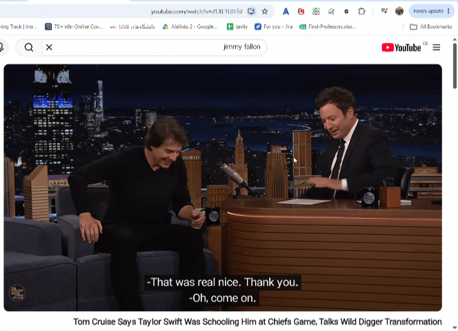

<div align="center">


# 🎬 Subify

### **ببین. بفهم. یاد بگیر. 🌍**

**ترجمه زیرنویس با هوش مصنوعی، زیرنویس دوزبانه و دوبله زنده برای یوتیوب.**

ویدیوهای زبان‌های دیگر را با ترجمه هم‌زمان، زیرنویس دوزبانه، خروجی زیرنویس و دوبله صوتی با هوش مصنوعی قابل‌فهم‌تر کن.

[](README.En.md)
[](README.md)

<br>

[](#)
[](LICENSE)

<br>

[🌐 وب‌سایت](https://sub-ify.site/) · [🟢 Chrome Web Store](https://chromewebstore.google.com/detail/subify-%D8%AA%D8%B1%D8%AC%D9%85%D9%87%D8%8C-%D8%AF%D9%88%D8%A8%D9%84%D9%87-%D9%88%D8%B2%DB%8C%D8%B1/lkddchadfmlncbjhekdjhhddahjafohg) · [🦊 Firefox Add-ons](https://addons.mozilla.org/en-US/firefox/addon/subify-lite/)

</div>

---

## 🎥 سابیفای را در عمل ببین

<p align="center">
  
</p>

<p align="center">
  <i>زیرنویس یوتیوب را ترجمه کن و ویدیو را به زبان خودت دنبال کن.</i>
</p>

---

## 🌍 سابیفای چیه؟

**Subify یک افزونهٔ رایگان و متن‌باز برای فهمیدن ویدیوهای زبان‌های دیگر در یوتیوب است.**

زیرنویس را هم‌زمان ترجمه کن، زیرنویس دوزبانه ببین، ظاهر آن را شخصی‌سازی کن، خروجی بگیر و وقتی ترجیح می‌دهی به‌جای خواندن گوش بدهی، از دوبله زنده با هوش مصنوعی استفاده کن.

Subify برای زبان‌آموزها، دانشجوها، کسانی که دوره‌های آموزشی می‌بینند، شنوندگان پادکست و هرکسی ساخته شده که مرتب محتوایی به زبانی غیر از زبان خودش تماشا می‌کند.

---

## 🎥 سابیفای را در عمل ببین

> **یک Demo خوب باید محصول را نشان بدهد، نه اینکه برایش سخنرانی کند.**
>
> اینجا بعداً یک GIF یا ویدیوی کوتاه اضافه کن که این جریان را نشان بدهد:
> ۱. پخش یک ویدیوی یوتیوب به زبان دیگر
> ۲. ترجمه زیرنویس توسط Subify
> ۳. نمایش هم‌زمان زیرنویس دوزبانه
> ۴. فعال‌شدن دوبله زنده

---

## ✨ ویژگی‌ها

### 🌐 ترجمه هم‌زمان زیرنویس
کپشن‌های زمان‌بندی‌شده یوتیوب را مستقیماً از خود ویدیو ترجمه کن، بدون اینکه لازم باشد فایل زیرنویس جداگانه دانلود کنی.

### ⚡ ترجمه پیش‌دستانه
بخش‌های بعدی زیرنویس از قبل ترجمه می‌شوند تا هنگام رسیدن گوینده به آن بخش، ترجمه آماده باشد و با زمان پخش هماهنگ بماند.

### 🔤 زیرنویس دوزبانه
زبان اصلی و ترجمه را کنار هم ببین تا هم معنی را بفهمی و هم متن زبان اصلی را از دست ندهی.

### 🎙️ دوبله زنده با هوش مصنوعی
با ترجمه زنده مبتنی بر Gemini، صدای ترجمه‌شده را هنگام پخش ویدیو بشنو و موارد زیر را تنظیم کن:
- بلندی صدای دوبله
- کاهش صدای اصلی (Ducking)
- سرعت پخش
- انتخاب صدا

### 🔄 حالت Chunked fallback
اگر مسیر Live در دسترس نباشد، از مسیر ترجمه تکه‌ای استفاده کن.

### 🧠 چند سرویس هوش مصنوعی
با کلید API خودت از سرویس‌های پشتیبانی‌شده استفاده کن:
- Google Gemini
- OpenRouter
- OpenAI

### 💾 خروجی زیرنویس
زیرنویس ترجمه‌شده را در این فرمت‌ها ذخیره کن:
- SRT
- VTT
- TXT

### 🎨 شخصی‌سازی زیرنویس
ظاهر زیرنویس را با پیش‌نمایش زنده، قالب‌های آماده و فونت‌های فارسی از جمله Vazirmatn، Estedad و Lalezar شخصی‌سازی کن.

### 📚 یادگیری لغت
لغات را از زیرنویس استخراج کن و با یک سیستم فلش‌کارت مبتنی بر Leitner به‌صورت محلی مرور کن.

### 🔒 حریم خصوصی Local-first
کلیدهای API و تنظیمات افزونه در مرورگر ذخیره می‌شوند و درخواست‌ها به YouTube و API سرویس هوش مصنوعی انتخاب‌شده توسط کاربر ارسال می‌شوند.

---

## 🎯 چرا Subify؟

محتوای زبان‌های دیگر همه‌جا هست.

مشکل پیدا کردن ویدیو نیست.  
**مشکل، فهمیدن آن است.**

Subify ابزار ترجمه و دوبله را مستقیماً کنار خود محتوا می‌آورد تا مجبور نباشی مدام بین پلیر، فایل زیرنویس و ابزارهای ترجمه جابه‌جا شوی.

**بیشتر ببین. بیشتر بفهم. همان‌جا یاد بگیر.**

---

## 📦 نصب

Subify در حال حاضر برای **Chrome** و **Firefox** در دسترس است.

### 🟢 Chrome

[](https://chromewebstore.google.com/detail/subify-%D8%AA%D8%B1%D8%AC%D9%85%D9%87%D8%8C-%D8%AF%D9%88%D8%A8%D9%84%D9%87-%D9%88%D8%B2%DB%8C%D8%B1/lkddchadfmlncbjhekdjhhddahjafohg)

### 🦊 Firefox

[](https://addons.mozilla.org/en-US/firefox/addon/subify-lite/)

### 🌐 وب‌سایت

[](https://sub-ify.site/)

---

## 🚀 شروع سریع

۱. Subify را از Chrome Web Store یا Firefox Add-ons نصب کن.
۲. وارد تنظیمات افزونه شو.
۳. کلید API یکی از سرویس‌های Gemini، OpenRouter یا OpenAI را وارد کن.
۴. یک ویدیوی یوتیوب که کپشن دارد باز کن.
۵. **ترجمه زیرنویس** یا **دوبله زنده صوتی** را فعال کن.
۶. در صورت نیاز ظاهر زیرنویس را شخصی‌سازی کن یا خروجی SRT، VTT یا TXT بگیر.

---

## 🧠 سرویس‌های هوش مصنوعی

Subify از معماری مبتنی بر Provider استفاده می‌کند تا کاربر بتواند سرویس هوش مصنوعی موردنیاز خودش را انتخاب کند.

| سرویس | کاربرد |
|---|---|
| Google Gemini | ترجمه و ترجمه صوتی زنده |
| OpenRouter | ترجمه متنی با مدل‌های پشتیبانی‌شده |
| OpenAI | ترجمه متنی با API اوپن‌ای‌آی |

> **کلید API خودت را استفاده کن:** Subify بر پایه اعتبارنامه‌هایی طراحی شده که خود کاربر وارد می‌کند، نه یک کلید API مرکزی که افزونه نگه دارد.

---

## 🔐 حریم خصوصی و مجوزها

Subify با رویکرد **Local-first** طراحی شده است.

- کلیدهای API و تنظیمات افزونه به‌صورت محلی در مرورگر ذخیره می‌شوند.
- درخواست‌های هوش مصنوعی با کلید API تنظیم‌شده توسط کاربر ارسال می‌شوند.
- دسترسی شبکه‌ای افزونه به YouTube و API سرویس هوش مصنوعی انتخاب‌شده محدود شده است.
- اطلاعات یادگیری لغت و تنظیمات افزونه بر پایه ذخیره‌سازی محلی مرورگر هستند.

### مجوزهای افزونه

| مجوز | کاربرد |
|---|---|
| `storage` | ذخیره محلی تنظیمات و کلیدهای API |
| `tabCapture` / `offscreen` | دریافت صدای تب برای دوبله زنده |
| `activeTab` / `tabs` | تشخیص و تعامل با تب فعال یوتیوب |
| `downloads` | ذخیره خروجی زیرنویس |

---

## 🏗️ نحوه کار

```text
                 ┌─────────────────────┐
                 │      YouTube        │
                 │     + captions      │
                 └──────────┬──────────┘
                            │
                            ▼
                 ┌─────────────────────┐
                 │   موتور زیرنویس     │
                 │ زمان‌بندی + chunks  │
                 └──────────┬──────────┘
                            │
                            ▼
                 ┌─────────────────────┐
                 │    ترجمه با AI      │
                 │ Gemini / OpenRouter │
                 │       / OpenAI      │
                 └───────┬─────┬───────┘
                         │     │
                ┌────────┘     └────────┐
                ▼                       ▼
        ┌───────────────┐       ┌────────────────┐
        │ زیرنویس       │       │   دوبله زنده   │
        │ ترجمه‌شده /   │       │    صوتی        │
        │ دوزبانه       │       │                │
        └───────┬───────┘       └───────┬────────┘
                │                       │
                └───────────┬───────────┘
                            ▼
                     ┌─────────────┐
                     │   پلیر      │
                     │   YouTube   │
                     └─────────────┘
```

---

## 🛠️ ساختار پروژه

```text
Subify/
├── manifest.json
├── popup.html / popup.js
├── options.html / options.js
├── background.js
├── content.css
├── page-bridge.js / page-hook.js
├── subtitle-overlay.js
├── live-client.js
├── capture-worklet.js
├── offscreen.js / offscreen.html
├── storyboard.js / storyboard.html
├── learn.js / learn.html
├── fonts/
└── icons/
```

### بخش‌های اصلی

| فایل | نقش |
|---|---|
| `subtitle-overlay.js` | رندر و همگام‌سازی زیرنویس |
| `live-client.js` | اتصال زنده به Gemini |
| `background.js` | Service Worker افزونه |
| `offscreen.js` | پردازش صدا برای دوبله زنده |
| `learn.js` | سیستم یادگیری لغت |
| `storyboard.js` | رابط مربوط به Storyboard و زیرنویس |

---

## 🤝 مشارکت

Subify متن‌باز است و از مشارکت استقبال می‌کنیم.

```bash
git clone https://github.com/mobinbiback/Subify.git
cd Subify
```

بعد می‌توانی پروژه را به‌عنوان **Unpacked Extension** در مرورگرهای Chromium بارگذاری کنی یا از روند توسعه مناسب Firefox استفاده کنی.

برای پیشنهاد قابلیت، گزارش باگ یا بهبود پروژه، یک Issue باز کن یا Pull Request بفرست.

### روند مشارکت

```bash
git checkout -b feature/your-feature
git add .
git commit -m "Add your feature"
git push origin feature/your-feature
```

بعد یک Pull Request در GitHub باز کن.

---

## 🗺️ نقشه راه

Subify هنوز در حال توسعه است.

بخشی از مسیر توسعه:

- پشتیبانی از پلتفرم‌ها و سایت‌های آموزشی بیشتر
- بهبود کیفیت و سرعت ترجمه زیرنویس
- مدل‌ها و سرویس‌های هوش مصنوعی بیشتر
- بهبود دوبله زنده
- گزینه‌های بیشتر برای خروجی و شخصی‌سازی زیرنویس
- ابزارهای بهتر برای یادگیری زبان
- گسترش تجربه Subify فراتر از جریان فعلی افزونه

ایده‌ای داری؟ یک Issue باز کن و مشکلی که می‌خواهی حل شود را توضیح بده.

---

## ⭐ حمایت از پروژه

Subify رایگان و متن‌باز است.

اگر Subify کمک کرده ویدیویی را بهتر بفهمی، زبان یاد بگیری یا به محتوایی دسترسی پیدا کنی که قبلاً برایت سخت بود، **می‌توانی به ریپو یک Star بدهی.**

هر Star کمک می‌کند افراد بیشتری پروژه را پیدا کنند.

---

## 📝 لایسنس

Subify تحت [لایسنس MIT](LICENSE) منتشر شده است.

---

## 🔗 لینک‌ها

[🌐 وب‌سایت Subify](https://sub-ify.site/)

[💻 ریپوی GitHub](https://github.com/mobinbiback/Subify)

[🟢 Chrome Web Store](https://chromewebstore.google.com/detail/subify-%D8%AA%D8%B1%D8%AC%D9%85%D9%87%D8%8C-%D8%AF%D9%88%D8%A8%D9%84%D9%87-%D9%88%D8%B2%DB%8C%D8%B1/lkddchadfmlncbjhekdjhhddahjafohg)

[🦊 Firefox Add-ons](https://addons.mozilla.org/en-US/firefox/addon/subify-lite/)

---

<div align="center">

**ساخته‌شده با 💜 برای همهٔ کسانی که می‌خواهند بخش بیشتری از اینترنت را بفهمند.**

</div>
